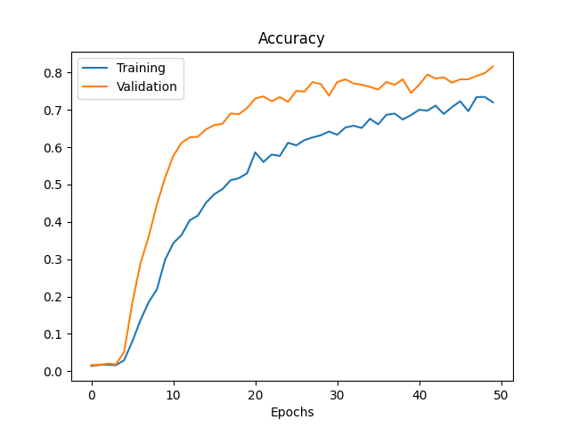
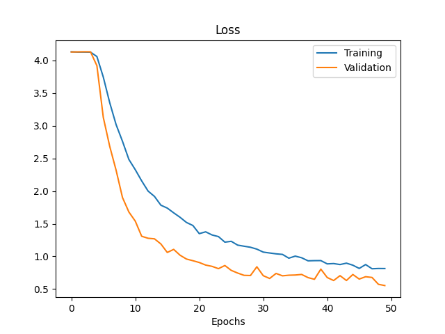

# KPMG - GPT-3 Ideation Project

## Description 

 The idea was to help automatise ideation using OPEN-AI GPT-3 API through the Miro tool of KPMG. 

## Usage 

The **Yolo_api.py** and **gpt3_chat.py** files are meant to work through Miro's online collaborative work platform. 

## Handwriting Recognition Feature

*This feature is still under research and development*

The challenge in hybrid meeting is to help people in a meeting, both online and on site, to collaborate easily without dedicating someone to the transcription of what is happening onsite to the Miro's environment. 

Our proposition was to develop a propotype of handwriting detection system that would capture, with the help of a fixed webcam towards a whiteboard/blackboard/..., the text being added on the board through post-it or markers. 

Different methods were explored among which: 

* Bounding Box detection with a simple implementation of **OpenCV**
* **OpenCV** in combination with **Tesseract**
* **EasyOCR**
* **Google Vision** 
* developping a model from scratch using CNN and a 1.2 million handwritten character dataset (*OCR_CNN_model.py*)

*Accuracy* and *Loss* for *OCR_CNN_model* with 75k images dataset: 

